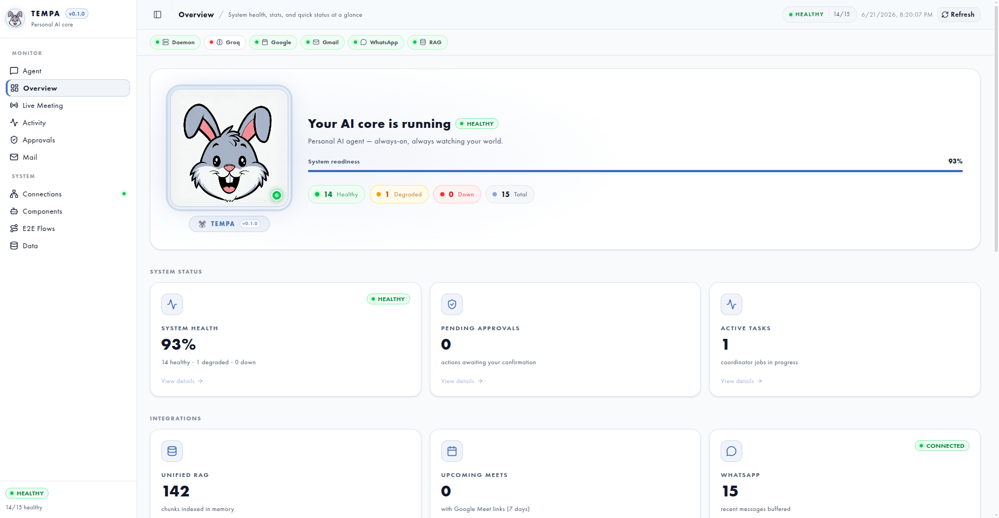
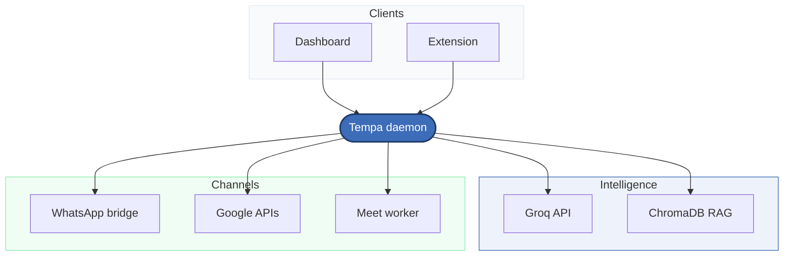

<p align="center">
<table cellpadding="8">
<tr>
<td align="center" valign="middle">


</a>
</td>
<td align="left" valign="middle">
<h1>Tempa</h1>
<p><strong>The AI that lives in your system core</strong><br />
always on · always connected</p>
<p>Gmail · Calendar · Google Meet · WhatsApp<br />
Unified memory · multi-agent · local-first</p>
</td>
</tr>
</table>
</p>

<p align="center">
https://github.com/Haroon966/Tempa/raw/main/animated_tempa.mp4
</p>

<p align="center">

</p>

<p align="center">
<a href="https://www.python.org/"></a>
<a href="https://fastapi.tiangolo.com/"></a>
<a href="docker-compose.yml"></a>
<a href="https://console.groq.com/"></a>
</p>

<p align="center">
<a href="http://localhost:8787"></a>
</p>

---

## ✦ Features

<table>
<tr>
<td width="50%" valign="top">
<ul>
<li>💬 <strong>WhatsApp</strong> — QR login once; read, reply &amp; remind with RAG context</li>
<li>📧 <strong>Gmail</strong> — OAuth inbox; compose, search &amp; manage mail</li>
<li>📅 <strong>Calendar</strong> — sync events, schedule &amp; WhatsApp reminders</li>
<li>🎥 <strong>Meet</strong> — auto-join, record, transcribe &amp; archive calls</li>
</ul>
</td>
<td width="50%" valign="top">
<ul>
<li>🧠 <strong>Unified RAG</strong> — one ChromaDB store, no memory silos</li>
<li>🤖 <strong>Multi-agent</strong> — LangGraph coordinator + parallel specialists</li>
<li>🧩 <strong>Extension</strong> — chat &amp; connections from Chrome</li>
<li>🔒 <strong>Local-first</strong> — your data stays on your machine</li>
</ul>
</td>
</tr>
</table>

---

## ✦ Architecture



<table>
<tr>
<td align="center"><code>8787</code><br /><sub>Tempa daemon</sub></td>
<td align="center">→</td>
<td align="center"><code>8080</code><br /><sub>WhatsApp bridge</sub></td>
<td align="center">→</td>
<td align="center"><code>5432</code><br /><sub>Postgres</sub></td>
</tr>
</table>

| Service | Port | Role |
|:--|:--:|:--|
| **Tempa daemon** | `8787` | API · dashboard · coordinator · webhooks |
| **WhatsApp bridge** | `8080` | Baileys sidecar · Evolution-compatible REST |
| **Meet worker** | — | Playwright join / record / transcribe |
| **Postgres** | `5432` | WhatsApp session storage |

---

## ✦ Quick start

<table>
<tr>
<td width="50%" valign="top">
<h3>🐳 Docker</h3>
<p><sub>recommended</sub></p>
<p><strong>①</strong> Copy env &amp; add keys</p>
<pre><code>cp .env.example .env</code></pre>
<p><strong>②</strong> Launch stack</p>
<pre><code>docker compose up -d</code></pre>
<p><strong>③</strong> Connect services at <strong>Connections</strong></p>
</td>
<td width="50%" valign="top">
<h3>🛠 Native</h3>
<p><strong>①</strong> Install</p>
<pre><code>python3 -m venv .venv
.venv/bin/pip install -e .
cp .env.example .env</code></pre>
<p><strong>②</strong> Run</p>
<pre><code>./scripts/run-native.sh</code></pre>
<p><strong>③</strong> Dev UI <em>(optional)</em></p>
<pre><code>cd dashboard &amp;&amp; npm i &amp;&amp; npm run dev</code></pre>
</td>
</tr>
</table>

> **Prerequisites** — Python 3.11+ · Docker · [Groq API key](https://console.groq.com/) · Google OAuth

---

## ✦ Configuration

| Variable | Purpose |
|:--|:--|
| `GROQ_API_KEY` | LLM, STT & safety inference |
| `GOOGLE_CLIENT_ID` / `GOOGLE_CLIENT_SECRET` | Calendar, Gmail, Meet OAuth |
| `WHATSAPP_OWNER_NUMBER` | Auto-reply & reminders target |
| `EVOLUTION_API_URL` | WhatsApp bridge · default `http://localhost:8080` |
| `EVOLUTION_API_KEY` | Bridge auth key |
| `TEMPA_INSTANCE_NAME` | WhatsApp instance name |

📄 [`.env.example`](.env.example) · [`services/whatsapp-bridge/.env.example`](services/whatsapp-bridge/.env.example)

---

## ✦ CLI

```bash
tempa start          # start daemon
tempa setup          # first-run wizard
tempa chat           # terminal chat
tempa whatsapp-qr    # show WhatsApp QR
tempa meet-auth      # Meet browser auth
```

---

## ✦ WhatsApp bridge

In-repo **Baileys bridge** at [`services/whatsapp-bridge/`](services/whatsapp-bridge/) — Evolution-compatible API on port **8080**, zero external vendor deps.

```bash
./scripts/test-whatsapp-qr.sh
```

<details>
<summary><strong>Migrating from Evolution API</strong></summary>
<p>Compatible session data if you used <code>evoapicloud/evolution-api</code> with Postgres <code>evolution</code> / <code>evolution:evolution</code>.</p>
<p>Rename volume <code>evolution_instances</code> → <code>whatsapp_instances</code>, or remount at <code>/app/instances</code>.</p>
<p>Env vars unchanged: <code>EVOLUTION_API_URL</code> · <code>EVOLUTION_API_KEY</code> · <code>TEMPA_INSTANCE_NAME</code></p>
</details>

---

## ✦ Development

```bash
.venv/bin/pip install -e ".[dev]"    # install dev deps
.venv/bin/pytest                     # run tests
.venv/bin/ruff check src tests       # lint
```

---

<p align="center"><strong>Tempa</strong> v0.1.0 · self-hosted AI personal core agent</p>
