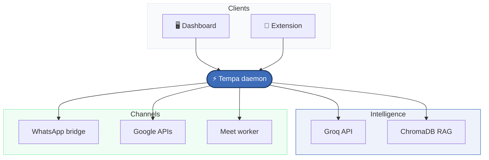

<div align="center">

<!-- Hero: video + name -->
<div style="background:#f4f6f6;border-radius:20px;border:1px solid #3d6cb925;padding:28px 36px;max-width:720px;margin:0 auto;box-shadow:0 8px 32px #3d6cb912;">
<table cellpadding="0" cellspacing="16">
<tr>
<td align="center" valign="middle">
<video autoplay loop muted playsinline width="200" style="display:block;">
  <source src="animated_tempa.mp4" type="video/mp4">
</video>
</td>
<td align="left" valign="middle">
<h1 style="margin:0 0 10px;border:none;font-size:2.8em;letter-spacing:-0.02em;color:#1e3a66;">Tempa</h1>
<p style="margin:0 0 8px;font-size:1.1em;color:#0f172a;"><b>The AI that lives in your system core</b><br/>always on · always connected</p>
<p style="margin:0;font-size:0.95em;color:#64748b;line-height:1.6;">Gmail · Calendar · Google Meet · WhatsApp<br/>Unified memory · multi-agent · local-first</p>
</td>
</tr>
</table>
</div>

<br />

<!-- Dashboard preview -->
<div style="max-width:920px;margin:0 auto;">

</div>

<br />

[](https://www.python.org/)
[](https://fastapi.tiangolo.com/)
[](docker-compose.yml)
[](https://console.groq.com/)

<br /><br />

<a href="http://localhost:8787"></a>

</div>

<br />

---

<br />

## ✦ Features

<table>
<tr>
<td width="50%" valign="top">

| | |
|:--|:--|
| 💬 | **WhatsApp** — QR login once; read, reply & remind with RAG context |
| 📧 | **Gmail** — OAuth inbox; compose, search & manage mail |
| 📅 | **Calendar** — sync events, schedule & WhatsApp reminders |
| 🎥 | **Meet** — auto-join, record, transcribe & archive calls |

</td>
<td width="50%" valign="top">

| | |
|:--|:--|
| 🧠 | **Unified RAG** — one ChromaDB store, no memory silos |
| 🤖 | **Multi-agent** — LangGraph coordinator + parallel specialists |
| 🧩 | **Extension** — chat & connections from Chrome |
| 🔒 | **Local-first** — your data stays on your machine |

</td>
</tr>
</table>

<br />

---

<br />

## ✦ Architecture



<table>
<tr>
<td align="center"><code>8787</code><br/><sub>Tempa daemon</sub></td>
<td align="center">→</td>
<td align="center"><code>8080</code><br/><sub>WhatsApp bridge</sub></td>
<td align="center">→</td>
<td align="center"><code>5432</code><br/><sub>Postgres</sub></td>
</tr>
</table>

| Service | Port | Role |
|:--|:--:|:--|
| **Tempa daemon** | `8787` | API · dashboard · coordinator · webhooks |
| **WhatsApp bridge** | `8080` | Baileys sidecar · Evolution-compatible REST |
| **Meet worker** | — | Playwright join / record / transcribe |
| **Postgres** | `5432` | WhatsApp session storage |

<br />

---

<br />

## ✦ Quick start

<table>
<tr>
<td width="50%" valign="top">

### 🐳 Docker
<sub>recommended</sub>

**①** Copy env & add keys
```bash
cp .env.example .env
```

**②** Launch stack
```bash
docker compose up -d
```

**③** Connect services at **Connections**

</td>
<td width="50%" valign="top">

### 🛠 Native

**①** Install
```bash
python3 -m venv .venv
.venv/bin/pip install -e .
cp .env.example .env
```

**②** Run
```bash
./scripts/run-native.sh
```

**③** Dev UI *(optional)*
```bash
cd dashboard && npm i && npm run dev
```

</td>
</tr>
</table>

> **Prerequisites** — Python 3.11+ · Docker · [Groq API key](https://console.groq.com/) · Google OAuth

<br />

---

<br />

## ✦ Configuration

| Variable | Purpose |
|:--|:--|
| `GROQ_API_KEY` | LLM, STT & safety inference |
| `GOOGLE_CLIENT_ID` / `GOOGLE_CLIENT_SECRET` | Calendar, Gmail, Meet OAuth |
| `WHATSAPP_OWNER_NUMBER` | Auto-reply & reminders target |
| `EVOLUTION_API_URL` | WhatsApp bridge · default `http://localhost:8080` |
| `EVOLUTION_API_KEY` | Bridge auth key |
| `TEMPA_INSTANCE_NAME` | WhatsApp instance name |

📄 [`.env.example`](.env.example) · [`services/whatsapp-bridge/.env.example`](services/whatsapp-bridge/.env.example)

<br />

---

<br />

## ✦ CLI

```bash
tempa start          # 🚀 start daemon
tempa setup          # ⚙️  first-run wizard
tempa chat           # 💬 terminal chat
tempa whatsapp-qr    # 📱 show WhatsApp QR
tempa meet-auth      # 🎥 Meet browser auth
```

<br />

---

<br />

## ✦ WhatsApp bridge

In-repo **Baileys bridge** at [`services/whatsapp-bridge/`](services/whatsapp-bridge/) — Evolution-compatible API on port **8080**, zero external vendor deps.

```bash
./scripts/test-whatsapp-qr.sh
```

<details>
<summary><b>↳ Migrating from Evolution API</b></summary>
<br />

Compatible session data if you used `evoapicloud/evolution-api` with Postgres `evolution` / `evolution:evolution`.

Rename volume `evolution_instances` → `whatsapp_instances`, or remount at `/app/instances`.

Env vars unchanged: `EVOLUTION_API_URL` · `EVOLUTION_API_KEY` · `TEMPA_INSTANCE_NAME`

</details>

<br />

---

<br />

## ✦ Development

```bash
.venv/bin/pip install -e ".[dev]"    # install dev deps
.venv/bin/pytest                     # run tests
.venv/bin/ruff check src tests       # lint
```

<br />

---

<div align="center">

<br />

<p style="color:#64748b;font-size:0.9em;">
<b style="color:#3d6cb9;">Tempa</b> v0.1.0 · self-hosted AI personal core agent
</p>

<br />

</div>
