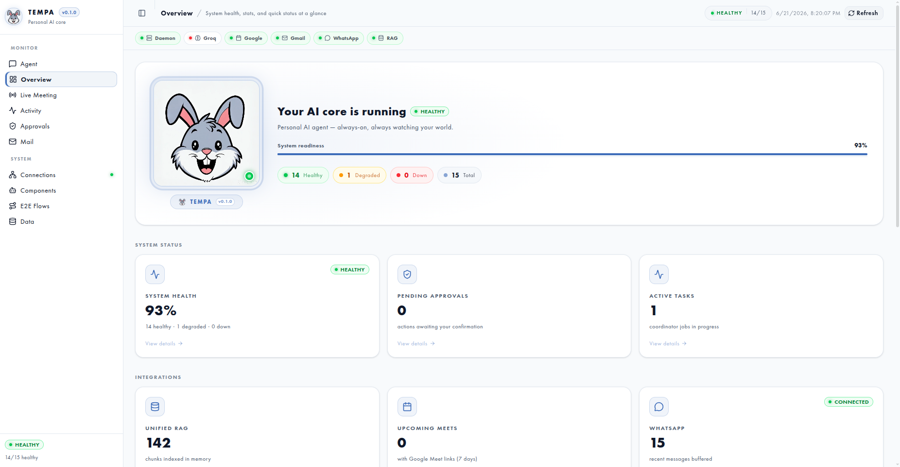
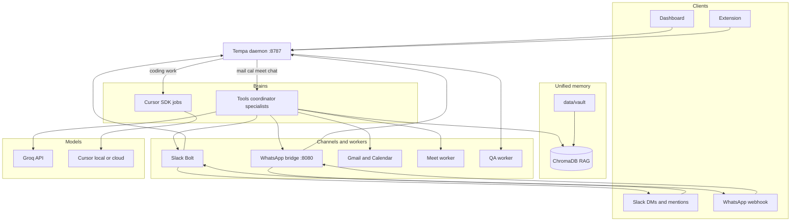
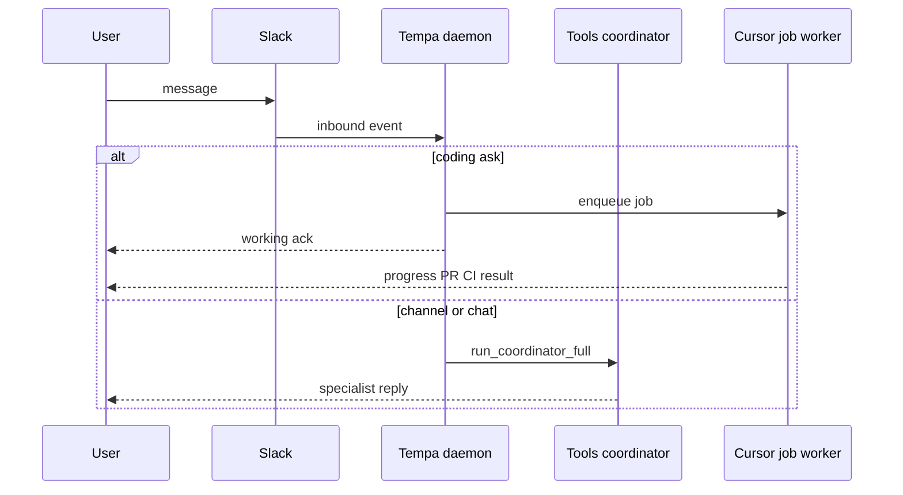
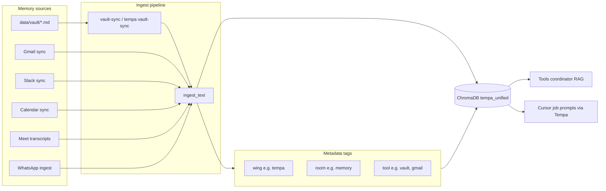
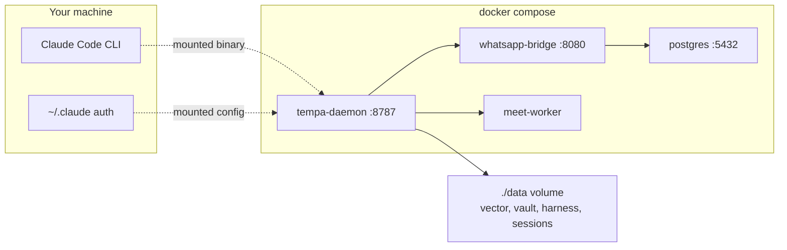

<p align="center">
<table cellpadding="8">
<tr>
<td align="center" valign="middle">


</a>
</td>
<td align="left" valign="middle">
<h1>Tempa</h1>
<p><strong>The AI that lives in your system core</strong><br />
always on · always connected</p>
<p>Gmail · Calendar · Google Meet · WhatsApp<br />
Unified memory · multi-agent · local-first</p>
</td>
</tr>
</table>
</p>

<p align="center">
https://github.com/Haroon966/Tempa/raw/main/animated_tempa.mp4
</p>

<p align="center">

</p>

<p align="center">
<a href="https://www.python.org/"></a>
<a href="https://fastapi.tiangolo.com/"></a>
<a href="docker-compose.yml"></a>
<a href="https://console.groq.com/"></a>
</p>

<p align="center">
<a href="http://localhost:8787"></a>
</p>

---

## ✦ Features

<table>
<tr>
<td width="50%" valign="top">
<ul>
<li>💬 <strong>WhatsApp</strong> — QR login once; read, reply &amp; remind with RAG context</li>
<li>📧 <strong>Gmail</strong> — OAuth inbox; compose, search &amp; manage mail</li>
<li>📅 <strong>Calendar</strong> — sync events, schedule &amp; WhatsApp reminders</li>
<li>🎥 <strong>Meet</strong> — auto-join, record, transcribe &amp; archive calls</li>
</ul>
</td>
<td width="50%" valign="top">
<ul>
<li>🧠 <strong>Unified RAG</strong> — one ChromaDB store, no memory silos</li>
<li>🤖 <strong>Varys coordinator</strong> — Claude Code CLI brain + optional LangGraph specialists</li>
<li>🧩 <strong>Extension</strong> — lightweight companion for status &amp; approvals (dashboard is primary)</li>
<li>🔒 <strong>Local-first</strong> — your data stays on your machine</li>
</ul>
</td>
</tr>
</table>

---

## ✦ Architecture

### System overview

Everything funnels through the **Tempa daemon** (`8787`). Channels ingest into unified memory; the **tools coordinator** handles Gmail, Calendar, Meet, Slack, and WhatsApp; **Cursor** owns coding (Slack engineering asks → durable jobs / PRs / CI).


```mermaid
flowchart TB
    subgraph clients [Clients]
        Dashboard[Dashboard]
        Extension[Extension]
        SlackIn[Slack DMs and mentions]
        WhatsAppIn[WhatsApp webhook]
    end

    Daemon["Tempa daemon :8787"]

    subgraph brain [Brains]
        Coord[Tools coordinator specialists]
        CursorJobs[Cursor SDK jobs]
    end

    subgraph memory [Unified memory]
        Chroma[(ChromaDB RAG)]
        Vault[data/vault]
    end

    subgraph channels [Channels and workers]
        SlackOut[Slack Bolt]
        WhatsAppBridge[WhatsApp bridge :8080]
        GoogleAPIs[Gmail and Calendar]
        MeetWorker[Meet worker]
        QAWorker[QA worker]
    end

    subgraph llm [Models]
        Groq[Groq API]
        CursorSDK[Cursor local or cloud]
    end

    Dashboard --> Daemon
    Extension --> Daemon
    SlackIn --> SlackOut --> Daemon
    WhatsAppIn --> WhatsAppBridge --> Daemon

    Daemon -->|"mail cal meet chat"| Coord
    Daemon -->|"coding work"| CursorJobs
    Coord --> Groq
    Coord --> Chroma
    Coord --> GoogleAPIs
    Coord --> SlackOut
    Coord --> WhatsAppBridge
    Coord --> MeetWorker
    CursorJobs --> CursorSDK
    Vault --> Chroma
    Daemon --> QAWorker
    SlackOut --> SlackIn
    WhatsAppBridge --> WhatsAppIn
```

### Message flow

- **Non-coding** (inbox, calendar, Meet, casual Slack/WA) → tools coordinator + specialists (Groq). Destructive channel actions still use pending-action / owner approval.
- **Coding** on Slack (pinned thread or coding heuristic + `config/cursor_threads.yaml` repo) → Cursor job queue; worker posts progress, opens PRs, waits on CI, escalates after failed fix cycles. No Varys harness ticket / “reply go” for code.
- **WhatsApp** casual chat still uses the fast Groq path unless routed to the full coordinator.
- Optional `VARYS_ORCHESTRATOR_ENABLED` tick remains for Notion/Jira/GitHub pollers only — not the chat coding brain.


```mermaid
sequenceDiagram
    participant User
    participant Slack
    participant Daemon as Tempa daemon
    participant Coord as Tools coordinator
    participant Cursor as Cursor job worker

    User->>Slack: message
    Slack->>Daemon: inbound event

    alt coding ask
        Daemon->>Cursor: enqueue job
        Daemon-->>User: working ack
        Cursor-->>User: progress PR CI result
    else channel or chat
        Daemon->>Coord: run_coordinator_full
        Coord-->>User: specialist reply
    end
```

### Memory and vault

Varys vault files and all channel ingest share **one** Chroma collection — no memory silos.


```mermaid
flowchart LR
    subgraph sources [Memory sources]
        VaultFiles["data/vault/*.md"]
        GmailSync[Gmail sync]
        SlackSync[Slack sync]
        CalendarSync[Calendar sync]
        MeetArchive[Meet transcripts]
        WhatsAppIdx[WhatsApp ingest]
    end

    subgraph ingest [Ingest pipeline]
        VaultSync[vault-sync / tempa vault-sync]
        IngestFn[ingest_text]
    end

    Chroma[(ChromaDB tempa_unified)]

    subgraph meta [Metadata tags]
        Wing[wing e.g. tempa]
        Room[room e.g. memory]
        Tool[tool e.g. vault, gmail]
    end

    VaultFiles --> VaultSync --> IngestFn
    GmailSync --> IngestFn
    SlackSync --> IngestFn
    CalendarSync --> IngestFn
    MeetArchive --> IngestFn
    WhatsAppIdx --> IngestFn
    IngestFn --> Chroma
    IngestFn --> meta
    meta --> Chroma

    Chroma --> ToolsCoord[Tools coordinator RAG]
    Chroma --> CursorCtx[Cursor job prompts via Tempa]
```

### Docker layout


```mermaid
flowchart LR
    subgraph host [Your machine]
        ClaudeBin[Claude Code CLI]
        ClaudeCfg["~/.claude auth"]
    end

    subgraph compose [docker compose]
        DaemonC[tempa-daemon :8787]
        BridgeC[whatsapp-bridge :8080]
        MeetC[meet-worker]
        PgC[postgres :5432]
    end

    Data["./data volume<br/>vector, vault, harness, sessions"]

    ClaudeBin -.->|mounted binary| DaemonC
    ClaudeCfg -.->|mounted config| DaemonC
    DaemonC --> Data
    DaemonC --> BridgeC
    DaemonC --> MeetC
    BridgeC --> PgC
```

<table>
<tr>
<td align="center"><code>8787</code><br /><sub>Tempa daemon</sub></td>
<td align="center">→</td>
<td align="center"><code>8080</code><br /><sub>WhatsApp bridge</sub></td>
<td align="center">→</td>
<td align="center"><code>5432</code><br /><sub>Postgres</sub></td>
</tr>
</table>

| Service | Port | Role |
|:--|:--:|:--|
| **Tempa daemon** | `8787` | API · dashboard · coordinator · webhooks · Varys tick |
| **WhatsApp bridge** | `8080` | Baileys sidecar · Evolution-compatible REST |
| **Meet worker** | — | Playwright join / record / transcribe |
| **Postgres** | `5432` | WhatsApp session storage |

---

## ✦ Coordinator and Cursor

| Setting | Purpose |
|:--|:--|
| `TEMPA_COORDINATOR` | `langgraph` (default tools path) · `varys` · `hybrid` — Claude merge only when Cursor does not own coding |
| `CURSOR_API_KEY` | Cursor SDK for Slack coding jobs + deep PR review |
| `config/cursor_threads.yaml` | `repos:` mounts + optional `threads:` pin overrides (see `.example`) |
| `SLACK_OWNER_USER_ID` / `SLACK_ALLOWED_USER_IDS` | Who may use private tools and Cursor coding |
| `TEMPA_REPOS_HOST` | Host folder mounted at `/repos` (default `./repos`) |
| `VARYS_ORCHESTRATOR_ENABLED` | Optional background tick (pollers) — not the coding brain |
| `TEMPA_ADK_SPIKE` | Experimental ADK path — keep `false` |
| `VARYS_VAULT_DIR` | Persistent vault memory (`data/vault`) |

### Slack Cursor coding setup

1. Set `CURSOR_API_KEY` and Slack allowlist (`SLACK_OWNER_USER_ID` / `SLACK_ALLOWED_USER_IDS`). Keep `SLACK_ALLOW_ALL=false` unless the whole workspace is trusted.
2. Clone repos under `./repos/<name>` (or set `TEMPA_REPOS_HOST`).
3. Copy from [`config/cursor_threads.yaml.example`](config/cursor_threads.yaml.example) into [`config/cursor_threads.yaml`](config/cursor_threads.yaml): set `local_cwd: /repos/<name>`, optional `repo`, `required_checks`.
4. Ensure the daemon image has `git` + `gh` for write/PR jobs; worktrees use `/repos/tempa-worktrees`.
5. In Slack, @Tempa with a coding ask (or use a pinned `threads:` entry). Guests are denied. Progress posts land in the thread; jobs appear on the dashboard QA → Tempa Cursor jobs board.

```bash
tempa varys status    # harness DB summary (optional tick)
tempa varys tick      # run one orchestrator tick
tempa vault-sync      # index vault into Chroma RAG
./scripts/vendor-varys.sh   # refresh vendored upstream
```

---

## ✦ Quick start

<table>
<tr>
<td width="50%" valign="top">
<h3>🐳 Docker</h3>
<p><sub>recommended</sub></p>
<p><strong>①</strong> Copy env &amp; add keys</p>
<pre><code>cp .env.example .env</code></pre>
<p><strong>②</strong> Launch stack</p>
<pre><code>docker compose up -d</code></pre>
<p><strong>③</strong> Complete setup at <strong>Setup</strong> (dashboard is the primary UI; extension is optional)</p>
</td>
<td width="50%" valign="top">
<h3>🛠 Native</h3>
<p><strong>①</strong> Install</p>
<pre><code>python3 -m venv .venv
.venv/bin/pip install -e .
cp .env.example .env</code></pre>
<p><strong>②</strong> Run</p>
<pre><code>./scripts/run-native.sh</code></pre>
<p><strong>③</strong> Dev UI <em>(optional)</em></p>
<pre><code>cd dashboard &amp;&amp; npm i &amp;&amp; npm run dev</code></pre>
</td>
</tr>
</table>

> **Prerequisites** — Python 3.11+ · Docker · [Groq API key](https://console.groq.com/) · Google OAuth

---

## ✦ Configuration

| Variable | Purpose |
|:--|:--|
| `GROQ_API_KEY` | LLM, STT & safety inference |
| `GOOGLE_CLIENT_ID` / `GOOGLE_CLIENT_SECRET` | Calendar, Gmail, Meet OAuth |
| `WHATSAPP_OWNER_NUMBER` | Auto-reply & reminders target |
| `SLACK_BOT_TOKEN` / `SLACK_APP_TOKEN` | Slack Socket Mode (bot + app-level token) |
| `SLACK_OWNER_USER_ID` | Slack user ID for DM auto-reply |
| `EVOLUTION_API_URL` | WhatsApp bridge · default `http://localhost:8080` |
| `EVOLUTION_API_KEY` | Bridge auth key |
| `TEMPA_INSTANCE_NAME` | WhatsApp instance name |
| `TEMPA_COORDINATOR` | `langgraph` (default) · `varys` · `hybrid` |
| `CURSOR_API_KEY` | Cursor SDK coding jobs + deep PR review |
| `VARYS_ORCHESTRATOR_ENABLED` | Optional Varys background tick (pollers) |
| `TEMPA_ADK_SPIKE` | Experimental ADK coordinator — keep false |
| `VARYS_CLAUDE_CLI_ONLY` | Claude Code CLI only (no Anthropic API fallback) |
| `CLAUDE_CODE_PATH` | Path to Claude Code CLI (`claude`) |
| `VARYS_VAULT_DIR` | Vault memory directory (default `data/vault`) |
| `NOTION_API_KEY` | Optional Notion brain for Varys harness |
| `JIRA_BASE_URL` / `JIRA_EMAIL` / `JIRA_API_TOKEN` | Jira Cloud (Connections tab or env) |
| `JIRA_ENABLED` | Enable Jira poller + chat tools |
| `JIRA_DEFAULT_PROJECT` | Default Jira project key (e.g. `ENG`) |

📄 [`.env.example`](.env.example) · [`services/whatsapp-bridge/.env.example`](services/whatsapp-bridge/.env.example)

---

## ✦ CLI

```bash
tempa start          # start daemon
tempa setup          # first-run wizard (initializes vault)
tempa chat           # terminal chat
tempa whatsapp-qr    # show WhatsApp QR
tempa meet-auth      # Meet browser auth
tempa varys status   # Varys harness summary
tempa varys tick     # manual orchestrator tick
tempa vault-sync     # index vault into RAG
```

---

## ✦ WhatsApp bridge

In-repo **Baileys bridge** at [`services/whatsapp-bridge/`](services/whatsapp-bridge/) — Evolution-compatible API on port **8080**, zero external vendor deps.

```bash
./scripts/test-whatsapp-qr.sh
```

<details>
<summary><strong>Migrating from Evolution API</strong></summary>
<p>Compatible session data if you used <code>evoapicloud/evolution-api</code> with Postgres <code>evolution</code> / <code>evolution:evolution</code>.</p>
<p>Rename volume <code>evolution_instances</code> → <code>whatsapp_instances</code>, or remount at <code>/app/instances</code>.</p>
<p>Env vars unchanged: <code>EVOLUTION_API_URL</code> · <code>EVOLUTION_API_KEY</code> · <code>TEMPA_INSTANCE_NAME</code></p>
</details>

---

## ✦ Slack (Socket Mode)

**Bot events** (Event Subscriptions): `message.im`, `app_mention`, and **`assistant_thread_started`** (if using Slack's Assistant chat UI).

- `SLACK_BOT_TOKEN` (`xoxb-…`)
- `SLACK_APP_TOKEN` (`xapp-…` with `connections:write`)
- `SLACK_OWNER_USER_ID` (your Slack member ID for DM auto-reply)

**Bot token scopes** (OAuth & Permissions) — your app currently needs at least:

- `app_mentions:read`
- `chat:write`
- `im:history`
- `im:read` ← required to list existing DMs
- `im:write` ← **required to open a new DM** (`conversations.open`); without it, “send this to …” fails
- `users:read`
- `channels:history`, `channels:read` (for @mentions in public channels)

**Required for DMs:** App Home → **Messages Tab** ON + allow user messages. **Event Subscriptions** → bot events **`message.im`** and **`app_mention`**. After changing scopes/events, **reinstall the app** to the workspace (OAuth → Install App).

DM the bot or `@mention` it in a channel. Outbound sends from the coordinator go through pending-action approval.

---

## ✦ Development

```bash
.venv/bin/pip install -e ".[dev]"    # install dev deps
.venv/bin/pytest                     # run tests
.venv/bin/ruff check src tests       # lint
```

---

<p align="center"><strong>Tempa</strong> v0.1.0 · self-hosted AI personal core agent</p>
