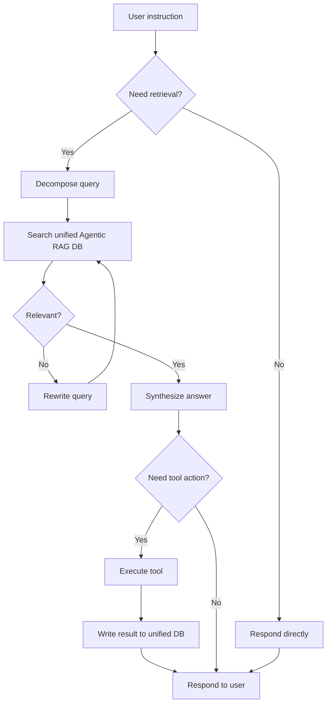
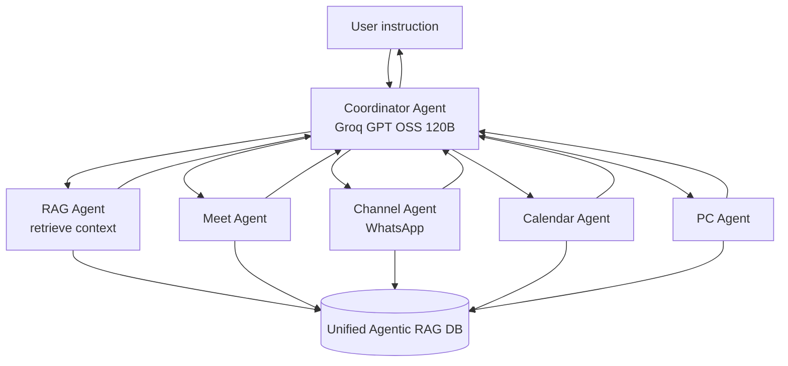
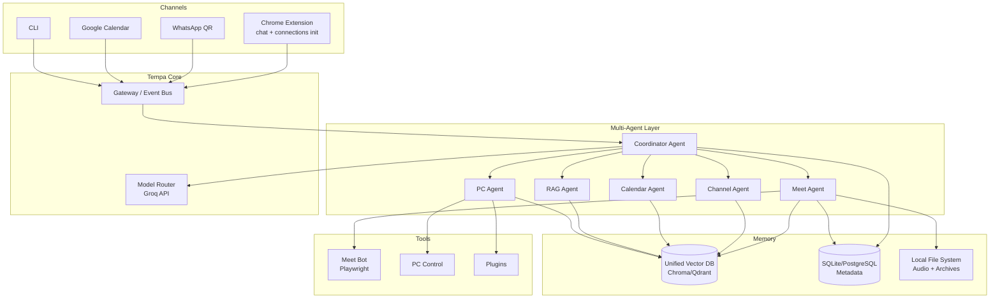

# Product Requirements Document (PRD)

## Tempa — AI Personal Core Agent

| Field | Value |
|-------|-------|
| **Product Name** | Tempa |
| **Version** | 1.0 |
| **Document Status** | Draft — implementation-ready |
| **Last Updated** | June 2026 |
| **Product Type** | Autonomous, self-hosted AI personal core agent |
| **Tagline** | *The AI that lives in your system core — always on, always connected, does everything.* |

---

## Table of Contents

1. [Executive Summary](#1-executive-summary)
2. [Product Overview](#2-product-overview) (incl. [MVP Boundary §2.4](#24-mvp-feature-boundary))
3. [Target Users & Personas](#3-target-users--personas)
4. [Scope & Constraints](#4-scope--constraints)
5. [Functional Requirements](#5-functional-requirements)
6. [Intelligence Layer — Unified Agentic RAG](#6-intelligence-layer--unified-agentic-rag)
7. [Multi-Agent Orchestration](#7-multi-agent-orchestration)
8. [Groq API — Model Strategy](#8-groq-api--model-strategy)
9. [Technical Architecture](#9-technical-architecture)
10. [Data Model & Storage](#10-data-model--storage)
11. [User Flows](#11-user-flows)
12. [User Stories](#12-user-stories)
13. [Non-Functional Requirements](#13-non-functional-requirements)
14. [Security & Privacy](#14-security--privacy)
15. [Success Metrics](#15-success-metrics)
16. [Roadmap](#16-roadmap)
17. [Dependencies, Risks & Mitigations](#17-dependencies-risks--mitigations)
18. [Appendix — Open-Source References](#18-appendix--open-source-references)

---

## 1. Executive Summary

**Tempa** is a persistent, self-hosted AI agent that runs at the system level and acts as a digital extension of the user. It connects to WhatsApp (via QR code), Google Calendar, and **Google Meet**, controls the local PC, and remembers everything through a **single unified Agentic RAG database**.

Unlike chatbots that only respond, Tempa **acts**: it joins Google Meet calls, records and transcribes them, replies on WhatsApp, manages calendar events, runs scripts, opens applications, and executes multi-step tasks autonomously — all grounded in one shared memory store.

**Key differentiators:**

- **One memory for everything** — WhatsApp threads, Meet transcripts, calendar events, and PC task outputs all index into the same Agentic RAG DB. No per-tool silos.
- **Google Meet native** — auto-join, record audio, live transcription, minutes, archive, and retrieval. Not Zoom or Teams.
- **WhatsApp via QR** — scan once with your phone; no Meta Business API.
- **Groq-powered inference** — all LLM, STT, and safety tasks routed through Groq API with per-task model selection and fallbacks.
- **Multi-agent parallelism** — a coordinator agent divides work across specialist agents (Meet, WhatsApp, Calendar, PC, RAG) that run in parallel on independent tasks, delivering results faster than a single monolithic agent.
- **Chrome extension UI** — primary interface to chat with Tempa, initialize all connections (Groq, Google, WhatsApp QR, backend), and monitor agent status from the browser.
- **Local-first** — data, audio, transcripts, and vector index stay on the user's machine. Groq is used for inference only.

---

## 2. Product Overview

### 2.1 Vision

Tempa is a persistent, self-hosted AI agent that acts as a digital extension of the user. It resides in the system core with full OS permissions, seamlessly integrating communication channels (WhatsApp, Calendar), **Google Meet** (auto-join and participate), PC control, and automation across all tools.

Powered by a **single unified Agentic RAG database** and a **multi-agent coordinator** that divides work across specialist agents running in parallel — delivering complex outcomes faster than a single-agent loop.

### 2.2 Mission

Eliminate manual digital drudgery by creating a true "always-on" personal AI core that handles reminders, Google Meet sessions, messaging, note-taking, scheduling, and system-level operations in real time.

### 2.3 Objectives

| # | Objective | Success indicator |
|---|-----------|-------------------|
| O1 | Full multi-channel automation (WhatsApp, Calendar, Google Meet) | User completes 90% of routine tasks without manual intervention |
| O2 | Natural language control from any connected platform | Commands work from Chrome extension, WhatsApp, and CLI |
| O3 | Complete Google Meet lifecycle — join, record, transcribe, archive, retrieve | 100% of joined calls saved with audio + transcript |
| O4 | Local-first privacy; Groq for inference only | No meeting data leaves local storage except Groq API calls |
| O5 | **One Agentic RAG DB** shared by all tools | Zero per-channel memory silos in architecture |
| O6 | Unlimited extensibility via plugins/tools | New tools plug into existing memory store without new DB |
| O7 | **Multi-agent work division** for speed | Parallel specialist agents reduce end-to-end task time by ≥ 40% vs single agent |
| O8 | **Chrome extension** as primary UI + connection hub | All integrations initialized and monitored from one browser panel |

### 2.4 MVP Feature Boundary

| In MVP (v1.0) |
|---------------|
| **Chrome extension** (chat, connections init, status, agent activity, meetings) |
| WhatsApp (QR), Google Calendar, Google Meet, PC control |
| Unified Agentic RAG, Groq model router, **multi-agent coordinator + specialists** |
| Meet record + transcribe + minutes + archive |
| Reminders via WhatsApp + desktop |
| Plugin tool registry |

---

## 3. Target Users & Personas

### 3.1 Primary User

Busy professionals, executives, developers, and freelancers who manage high communication volume across WhatsApp, calendar, and video calls.

### 3.2 Personas

#### Persona 1 — Alex (Tech Executive)

| Attribute | Detail |
|-----------|--------|
| **Role** | VP Engineering, 15+ meetings/week |
| **Pain** | Misses action items, forgets to join calls, drowns in WhatsApp |
| **Goals** | Auto Google Meet join, automatic minutes, WhatsApp auto-replies, calendar management |
| **Tempa value** | Joins standups automatically, sends minutes to team via WhatsApp, answers "what did we decide Tuesday?" from unified memory |

#### Persona 2 — Sarah (Freelancer)

| Attribute | Detail |
|-----------|--------|
| **Role** | Independent consultant, 5–8 clients |
| **Pain** | Context switching between client WhatsApp groups, manual PC tasks |
| **Goals** | PC automation, reminders, WhatsApp messaging |
| **Tempa value** | "Open VS Code and create invoice.md" via WhatsApp; reminders before client Google Meets |

#### Persona 3 — Enterprise Team Lead

| Attribute | Detail |
|-----------|--------|
| **Role** | Manages distributed team |
| **Pain** | No single source of truth across channels |
| **Goals** | Scalable multi-agent automation |
| **Tempa value** | Coordinator splits Meet + WhatsApp + PC work across agents in parallel; unified memory keeps all agents in sync |

---

## 4. Scope & Constraints

### 4.1 In Scope

| Area | Details |
|------|---------|
| **Messaging** | WhatsApp (QR pairing) |
| **Interfaces** | Chrome extension (primary), CLI, WhatsApp |
| **Connection init** | All connections configured via Chrome extension Connections panel |
| **Calendar** | Google Calendar API (primary); Outlook/Apple CalDAV (read sync) |
| **Video** | Google Meet only — `meet.google.com` |
| **AI inference** | Groq API exclusively for LLM, STT, and safety |
| **Memory** | Single Agentic RAG vector DB + local metadata DB |
| **Orchestration** | Multi-agent — coordinator + specialist agents (parallel execution) |
| **PC** | File ops, app control, shell, browser automation |
| **Deploy** | Docker, cross-platform (Linux, macOS, Windows) |

### 4.2 Hard Constraints

1. **Google Meet only** — no Zoom/Teams integration in any version before explicit scope change.
2. **One vector DB** — all tools read/write the same Chroma/Qdrant/LanceDB instance.
3. **WhatsApp via QR** — WhatsApp Web protocol; user scans QR from phone.
4. **Groq for models** — all inference through Groq API with category fallbacks.
5. **Local data** — audio files, transcripts, embeddings, and session tokens stored locally.
6. **Multi-agent by default** — complex tasks are decomposed and executed in parallel by specialist agents; all share the same unified Agentic RAG DB.
7. **Chrome extension** — primary UI; all connection initialization (Groq, Google, WhatsApp, daemon) through extension Connections panel.

---

## 5. Functional Requirements

### 5.1 Core Agent (FR-CORE)

| ID | Requirement | Priority |
|----|-------------|----------|
| FR-CORE-01 | Tempa runs as a persistent background daemon/service with auto-restart on crash | P0 |
| FR-CORE-02 | Accept natural language instructions via **Chrome extension**, WhatsApp, and CLI | P0 |
| FR-CORE-03 | Monitor WhatsApp and Google Calendar continuously for triggers | P0 |
| FR-CORE-04 | Route every incoming instruction through the Agentic RAG planner before acting | P0 |
| FR-CORE-05 | Persist every tool action result to the unified Agentic RAG DB | P0 |
| FR-CORE-06 | Support plugin/tool registration that auto-wires into unified ingestion | P1 |

### 5.2 WhatsApp Integration (FR-WA)

| ID | Requirement | Priority |
|----|-------------|----------|
| FR-WA-01 | Display QR code in **Chrome extension**, CLI, and popup for initial pairing | P0 |
| FR-WA-02 | User scans QR via phone: WhatsApp → Linked Devices → Link a Device | P0 |
| FR-WA-03 | Persist session auth state locally; auto-reconnect without re-scan | P0 |
| FR-WA-04 | Prompt new QR scan when session expires or disconnects | P0 |
| FR-WA-05 | Send and receive text messages, including group chats | P0 |
| FR-WA-06 | Handle media (images, audio, documents); transcribe voice notes via Groq Whisper | P1 |
| FR-WA-07 | Auto-reply using Groq Llama 3.3 70B (fast) or GPT OSS 120B (complex) | P0 |
| FR-WA-08 | Index all messages into unified Agentic RAG DB with metadata: `tool=whatsapp`, `participant`, `timestamp` | P0 |
| FR-WA-09 | Run outbound messages through Safety GPT OSS 20B before send | P1 |

**Technical stack:** In-repo Baileys bridge (`services/whatsapp-bridge/`) via WhatsApp Web protocol.

### 5.3 Calendar & Reminders (FR-CAL)

| ID | Requirement | Priority |
|----|-------------|----------|
| FR-CAL-01 | OAuth2 connect to Google Calendar | P0 |
| FR-CAL-02 | Poll calendar for events containing `meet.google.com` links | P0 |
| FR-CAL-03 | Create, update, and cancel calendar events via natural language | P1 |
| FR-CAL-04 | Send reminders N minutes before events via WhatsApp and/or desktop notification | P0 |
| FR-CAL-05 | On reminder trigger for Meet event: auto-join Google Meet (configurable) | P0 |
| FR-CAL-06 | Index calendar events into unified DB with `tool=calendar`, `meet_link`, `participants` | P0 |

### 5.4 Google Meet Intelligence (FR-MEET)

| ID | Requirement | Priority |
|----|-------------|----------|
| FR-MEET-01 | Detect `meet.google.com` URLs from Calendar or WhatsApp | P0 |
| FR-MEET-02 | Auto-join Meet via Playwright browser automation; Google account sign-in | P0 |
| FR-MEET-03 | Join with mic/camera off by default; configurable | P0 |
| FR-MEET-04 | Capture full meeting audio locally (mixed track) as WAV/MP3/OGG | P0 |
| FR-MEET-05 | Live transcription via Groq Whisper Large v3 Turbo (fallback: v3) | P0 |
| FR-MEET-06 | Real-time note-taking via Groq GPT OSS 120B during call | P0 |
| FR-MEET-07 | Post-meeting: full transcript with speaker labels and timestamps | P0 |
| FR-MEET-08 | Generate minutes: summary, decisions, action items, follow-ups (Groq GPT OSS 120B) | P0 |
| FR-MEET-09 | Save structured meeting archive locally (see §10 Data Model) | P0 |
| FR-MEET-10 | Index transcript + minutes into unified Agentic RAG DB | P0 |
| FR-MEET-11 | Distribute minutes/transcript excerpts via WhatsApp | P1 |
| FR-MEET-14 | Display recording indicator / consent notice when recording starts | P0 |

**Video:** Google Meet only — `meet.google.com` (no Zoom, Teams, or Webex).

### 5.5 PC & System Control (FR-PC)

| ID | Requirement | Priority |
|----|-------------|----------|
| FR-PC-01 | Open and close applications by name | P0 |
| FR-PC-02 | File operations: create, read, edit, search, delete (within allowed paths) | P0 |
| FR-PC-03 | Execute shell commands and Python scripts with user-configurable permissions | P0 |
| FR-PC-04 | Browser automation via Playwright (non-Meet use cases) | P1 |
| FR-PC-06 | Log all PC actions to unified Agentic RAG DB with `tool=pc` | P1 |

### 5.6 Plugin System (FR-PLUGIN)

| ID | Requirement | Priority |
|----|-------------|----------|
| FR-PLUGIN-01 | Plugins register tools with name, description, input schema, handler | P1 |
| FR-PLUGIN-02 | Plugin outputs auto-ingested into unified Agentic RAG DB | P1 |
| FR-PLUGIN-03 | Plugins use Groq function-calling models for tool selection | P1 |
| FR-PLUGIN-04 | No plugin may create its own vector store | P0 |

### 5.7 Multi-Agent Orchestration (FR-MA)

| ID | Requirement | Priority |
|----|-------------|----------|
| FR-MA-01 | **Coordinator Agent** receives all instructions, decomposes into sub-tasks, assigns to specialists | P0 |
| FR-MA-02 | Specialist agents run **in parallel** when sub-tasks have no dependency | P0 |
| FR-MA-03 | All agents read/write the **same unified Agentic RAG DB** — no per-agent memory | P0 |
| FR-MA-04 | Coordinator merges specialist outputs into a single user-facing response | P0 |
| FR-MA-05 | Specialist failure triggers coordinator retry or fallback agent | P1 |
| FR-MA-06 | Dashboard shows live agent activity (which agent is doing what) | P1 |
| FR-MA-07 | Groq GPT OSS 120B powers coordinator planning and task decomposition | P0 |

**Specialist agents (MVP):**

| Agent | Responsibility | Tools |
|-------|----------------|-------|
| **Coordinator** | Plan, decompose, assign, merge | Groq reasoning, Agentic RAG |
| **Meet Agent** | Join, record, transcribe, minutes | Playwright, Groq Whisper, Groq GPT OSS |
| **Channel Agent** | WhatsApp messaging, reminders | In-repo WhatsApp bridge (Baileys) |
| **Calendar Agent** | Poll events, Meet links, reminders | Google Calendar API |
| **RAG Agent** | Retrieve, grade, rewrite, synthesize | Unified vector DB |
| **PC Agent** | Files, apps, shell, browser | OS tools, Playwright |

### 5.8 Chrome Extension — Primary Interface (FR-EXT)

The **Chrome extension** is Tempa's main user interface and **connection initialization hub**. All integrations are set up, monitored, and re-connected from the extension — no separate web dashboard required for MVP.

| ID | Requirement | Priority |
|----|-------------|----------|
| FR-EXT-01 | Manifest V3 Chrome extension: popup + side panel + options page | P0 |
| FR-EXT-02 | **Connections Init panel** — single screen to initialize all integrations | P0 |
| FR-EXT-03 | Connect to local Tempa daemon via `http://localhost:{port}` (WebSocket + REST) | P0 |
| FR-EXT-04 | **Groq** — enter/save `GROQ_API_KEY`; test connection; show model router status | P0 |
| FR-EXT-05 | **Google** — OAuth2 flow for Calendar + Meet; show connected account + reconnect | P0 |
| FR-EXT-06 | **WhatsApp** — display QR code; show connected/disconnected; re-scan button | P0 |
| FR-EXT-08 | **Backend** — detect Tempa daemon; start/stop/restart; show health | P0 |
| FR-EXT-09 | Connection status badges: Groq, Google, WhatsApp, Daemon, RAG DB (green/yellow/red) | P0 |
| FR-EXT-10 | **Chat panel** — send instructions to Coordinator; stream responses | P0 |
| FR-EXT-11 | **Agent activity** — live view of which specialist agent is running what task | P1 |
| FR-EXT-12 | **Meetings tab** — list archives, play audio, read transcript/minutes | P1 |
| FR-EXT-13 | **Memory search** — query unified Agentic RAG DB from extension | P1 |
| FR-EXT-14 | Store extension prefs locally (`chrome.storage.local`); secrets forwarded to daemon only | P0 |
| FR-EXT-15 | Badge icon shows overall connection health (all green = ready) | P1 |

**Connections Init flow (extension):**

```
Install extension → Open side panel → Connections
  1. Link Tempa daemon (localhost)
  2. Enter Groq API key → Test
  3. Sign in Google (Calendar + Meet) → OAuth
  4. Scan WhatsApp QR
  → All badges green → Start chatting
```

**Technical stack:** TypeScript, React or Preact, Chrome Extension Manifest V3, `chrome.sidePanel`, native messaging optional for daemon discovery.

**Daemon API endpoints (extension consumes):**

| Endpoint | Method | Purpose |
|----------|--------|---------|
| `/api/health` | GET | Daemon + agent status |
| `/api/connections` | GET | All connection statuses (Groq, Google, WhatsApp, RAG, Daemon) |
| `/api/connections/groq` | POST | Save + test Groq API key |
| `/api/connections/groq/models` | GET | Model router chains |
| `/api/connections/google` | POST | Start OAuth / check token |
| `/api/connections/whatsapp` | GET | QR code image/data URL + session status |
| `/api/chat` | POST | Send message to Coordinator (SSE stream) |
| `/api/agents/activity` | WS | Live specialist agent activity |
| `/api/meetings` | GET | List meeting archives |
| `/api/memory/search` | POST | Query unified Agentic RAG DB |

---

## 6. Intelligence Layer — Unified Agentic RAG

### 6.1 Core Principle

**One database. All tools. No silos.**

Every tool — WhatsApp, Google Meet, Calendar, PC control, plugins — reads from and writes to the **same** Agentic RAG vector database. There is no separate "Meet memory" or "WhatsApp memory."

### 6.2 What Is Agentic RAG?

Agentic RAG is not passive "retrieve once, generate once." The agent:

1. **Decides** whether retrieval is needed or it can answer from working context.
2. **Decomposes** complex queries into sub-queries.
3. **Routes** searches across the unified index using metadata filters.
4. **Iterates** — re-retrieves if results are irrelevant (grade → rewrite → re-retrieve).
5. **Synthesizes** an answer with source citations.
6. **Writes back** summaries and embeddings after every action.



### 6.3 Unified Metadata Schema

Every document chunk indexed into the vector DB must include:

| Field | Type | Example | Required |
|-------|------|---------|----------|
| `id` | UUID | `a1b2c3...` | Yes |
| `tool` | string | `whatsapp`, `meet`, `calendar`, `pc`, `plugin` | Yes |
| `source` | string | `transcript`, `message`, `minutes`, `event`, `file` | Yes |
| `timestamp` | ISO 8601 | `2026-06-15T10:30:00Z` | Yes |
| `participants` | string[] | `["alice@co.com", "+1234567890"]` | No |
| `title` | string | `Product Sync — June 15` | No |
| `tags` | string[] | `["action-item", "standup"]` | No |
| `meet_link` | string | `https://meet.google.com/abc-defg-hij` | No |
| `content` | text | Chunk text | Yes |
| `embedding` | float[] | Vector | Yes |

### 6.4 Memory Layers (Same DB)

| Layer | Content | Write trigger |
|-------|---------|---------------|
| **Episodic** | Raw interactions — messages, transcript segments, commands | On every tool event |
| **Semantic** | Extracted facts, preferences, decisions, action items | After Meet ends, daily consolidation job |
| **Procedural** | How user likes things done ("always send minutes to WhatsApp group X") | Agent inference + user confirmation |

### 6.5 Retrieval Agent Behavior

| Capability | Implementation |
|------------|----------------|
| Query decomposition | Groq GPT OSS 120B splits multi-part questions |
| Metadata filtering | Filter by `tool`, `date`, `participant`, `tags` before vector search |
| Hybrid search | Vector similarity + keyword (BM25) with RRF fusion |
| Relevance grading | Groq GPT OSS 20B scores retrieved chunks 0–1 |
| Question rewrite | If grade < 0.5, rewrite query and re-retrieve (max 3 iterations) |
| Cross-source synthesis | Combine Meet transcript + WhatsApp thread + calendar context in one answer |

### 6.6 Ingestion Pipeline

```
Tool event → Normalize text → Chunk (512 tokens, 64 overlap)
          → Embed locally (nomic-embed-text)
          → Attach metadata schema
          → Upsert to single vector DB
          → Optional: Groq GPT OSS 20B summary → semantic layer write-back
```

**Rules:**
- Meet transcript chunks: one chunk per ~30 seconds or per speaker turn.
- WhatsApp: one chunk per message or per thread summary for long groups.
- No tool may bypass the ingestion pipeline.

---

## 7. Multi-Agent Orchestration

### 7.1 Why Multi-Agent?

A single agent handling Meet transcription, WhatsApp replies, calendar polling, and PC tasks **sequentially** is slow. Tempa uses a **coordinator + specialist** pattern:

- **Divide** — coordinator breaks a user goal into independent sub-tasks.
- **Parallelize** — specialists execute simultaneously (e.g., Meet Agent joins call while Calendar Agent fetches context from RAG).
- **Merge** — coordinator synthesizes results and responds once.
- **Share memory** — all agents use the **same unified Agentic RAG DB**; no sync issues.

**Target:** ≥ 40% faster end-to-end completion on multi-step tasks vs single-agent sequential execution.

### 7.2 Agent Topology



### 7.3 Parallel Execution Rules

| Rule | Description |
|------|-------------|
| **Independent = parallel** | Sub-tasks with no data dependency run concurrently (asyncio / LangGraph parallel nodes) |
| **Dependent = sequential** | "Send minutes after Meet ends" — Meet Agent completes → then Channel Agent sends |
| **Shared context via RAG** | Specialists query unified DB before acting; write results back after |
| **One coordinator** | Only the Coordinator talks to the user; specialists report to Coordinator |
| **Idempotent writes** | Concurrent writes to vector DB use chunk IDs to avoid duplicates |

### 7.4 Example — Parallel Meet Prep

User (WhatsApp): *"Prepare for my 2pm Google Meet and remind the team."*

| Step | Agent | Action | Parallel? |
|------|-------|--------|-----------|
| 1 | Coordinator | Decompose into 3 sub-tasks | — |
| 2 | RAG Agent | Retrieve last week's Meet notes + WhatsApp thread | ∥ |
| 2 | Calendar Agent | Fetch 2pm event, confirm Meet link | ∥ |
| 2 | Channel Agent | Draft reminder message to team group | ∥ |
| 3 | Coordinator | Merge context + send reminder via Channel Agent | Sequential |
| 4 | Meet Agent | At T−2 min: auto-join, record, transcribe | Scheduled |

Steps 2a–2c run **in parallel** — total time ≈ slowest agent, not sum of all three.

### 7.5 Implementation

- **Framework:** LangGraph with parallel `Send` API or fan-out/fan-in graph nodes.
- **Reference:** [crewAIInc/crewAI](https://github.com/crewAIInc/crewAI), [bytedance/deer-flow](https://github.com/bytedance/deer-flow) for role-based patterns.
- **Groq:** Coordinator uses GPT OSS 120B; specialists use Llama 3.3 70B (fast) or task-appropriate model from §8.

---

## 8. Groq API — Model Strategy

### 8.1 Overview

All AI inference runs through the **Groq API** using a single `GROQ_API_KEY`. Tempa does not call OpenAI, Anthropic, or local Ollama for inference in production.

**Exception:** Embeddings use a **local** model (nomic-embed-text or BGE) because Groq does not provide an embedding API.

### 8.2 Model Routing Table

| Task category | Primary model | Fallback chain | Use cases |
|---------------|---------------|----------------|-----------|
| **Reasoning** | GPT OSS 120B | → GPT OSS 20B → Qwen 3 32B | Multi-step planning, Agentic RAG loops, task decomposition |
| **Function calling / tool use** | GPT OSS 120B | → GPT OSS 20B → Llama 4 Scout → Qwen 3 32B | Tool selection, WhatsApp/Calendar/PC actions |
| **Text to text** | Llama 3.3 70B | → GPT OSS 120B → GPT OSS 20B → Llama 4 Scout | Chat replies, summaries, quick commands |
| **Multilingual** | Llama 3.3 70B | → GPT OSS 120B → Llama 4 Scout → Whisper Large v3 | Arabic WhatsApp, multilingual Meet transcripts |
| **Speech to text** | Whisper Large v3 Turbo | → Whisper Large v3 | Live Meet transcription, WhatsApp voice notes |
| **Safety / moderation** | Safety GPT OSS 20B | — | Outbound message screening, content policy |

### 8.3 Router Logic

```python
# Pseudocode — config/groq_models.yaml drives model IDs
def route(task: TaskType, context: dict) -> GroqModel:
    chain = MODEL_CHAINS[task]
    for model in chain:
        if groq_client.is_available(model):
            return model
    raise AllModelsUnavailable(task)
```

**Fallback triggers:**
- HTTP 429 (rate limit) → next model in chain
- HTTP 503 (model unavailable) → next model in chain
- Timeout > 30s on reasoning → downgrade to GPT OSS 20B

### 8.4 Configuration

```yaml
# config/groq_models.yaml (example structure)
api_key_env: GROQ_API_KEY

chains:
  reasoning:
    - openai/gpt-oss-120b
    - openai/gpt-oss-20b
    - qwen/qwen3-32b
  tool_use:
    - openai/gpt-oss-120b
    - openai/gpt-oss-20b
    - meta-llama/llama-4-scout-17b-16e-instruct
    - qwen/qwen3-32b
  text:
    - llama-3.3-70b-versatile
    - openai/gpt-oss-120b
    - openai/gpt-oss-20b
    - meta-llama/llama-4-scout-17b-16e-instruct
  stt:
    - whisper-large-v3-turbo
    - whisper-large-v3
  safety:
    - openai/gpt-oss-safety-20b
  multilingual:
    - llama-3.3-70b-versatile
    - openai/gpt-oss-120b
    - meta-llama/llama-4-scout-17b-16e-instruct
```

> **Note:** Exact Groq model ID strings must be verified against [console.groq.com/docs/models](https://console.groq.com/docs/models) at implementation time.

### 8.5 Groq Usage by Feature

| Tempa feature | Groq models used |
|---------------|------------------|
| WhatsApp auto-reply | Llama 3.3 70B (text), Safety GPT OSS 20B (screen) |
| WhatsApp voice note | Whisper v3 Turbo (STT) → Llama 3.3 70B (reply) |
| Coordinator planning | GPT OSS 120B (reasoning) |
| Specialist agents (fast path) | Llama 3.3 70B (text) |
| Agent planning | GPT OSS 120B (reasoning) |
| Tool execution | GPT OSS 120B (function calling) |
| Meet live transcription | Whisper v3 Turbo |
| Meet minutes | GPT OSS 120B (reasoning + extraction) |
| Agentic RAG retrieval grading | GPT OSS 20B |

---

## 9. Technical Architecture

### 9.1 High-Level Architecture



### 9.2 Technology Stack

| Layer | Technology | Notes |
|-------|------------|-------|
| **Language** | Python 3.11+ | Primary backend |
| **Agent framework** | LangGraph + LangChain | Multi-agent orchestration, parallel nodes, Agentic RAG |
| **Inference** | Groq API (`groq-python` SDK) | All LLM/STT/safety |
| **Embeddings** | nomic-embed-text (local) | Via sentence-transformers or Ollama embed |
| **Vector DB** | Chroma (default), Qdrant, or LanceDB | Single instance only |
| **Metadata DB** | SQLite (dev), PostgreSQL (prod) | Meeting records, sessions, config |
| **WhatsApp** | In-repo bridge (`services/whatsapp-bridge/`) | QR code pairing |
| **Google Meet** | Playwright + WebRTC audio hooks | `meet.google.com` only |
| **Google Calendar** | Google Calendar API v3 | OAuth2 |
| **Audio storage** | Local FS + optional MinIO/S3 | Meet recordings |
| **Daemon API** | FastAPI + WebSocket | REST for extension; localhost only |
| **Frontend** | **Chrome extension** (primary UI) + CLI | Extension: React/Preact, MV3, side panel |
| **Extension ↔ Daemon** | REST + WebSocket on `localhost` | CORS restricted to extension origin |
| **Deploy** | Docker Compose | Single-host self-hosted |

### 9.3 Project Structure (Proposed)

```
tempa/
├── config/
│   ├── groq_models.yaml      # Model routing chains
│   ├── agents.yaml           # Specialist agent definitions
│   ├── tools.yaml            # Enabled tools/plugins
│   └── permissions.yaml      # PC path allowlist
├── extension/                # Chrome extension (primary UI)
│   ├── manifest.json         # MV3
│   ├── src/
│   │   ├── popup/            # Quick status + open side panel
│   │   ├── sidepanel/        # Chat + Connections Init + Meetings
│   │   ├── options/          # Advanced settings
│   │   └── background/       # Service worker, daemon WebSocket
│   └── package.json
├── src/
│   ├── api/                  # FastAPI routes for Chrome extension
│   ├── agents/
│   │   ├── coordinator.py    # Task decomposition + merge
│   │   ├── meet_agent.py
│   │   ├── channel_agent.py  # WhatsApp
│   │   ├── calendar_agent.py
│   │   ├── rag_agent.py
│   │   └── pc_agent.py
│   ├── rag/                  # Unified ingestion + retrieval
│   ├── router/               # Groq model router
│   ├── channels/
│   │   ├── whatsapp/
│   │   └── calendar/
│   ├── meet/                 # Google Meet bot (used by Meet Agent)
│   ├── pc/                   # System control (used by PC Agent)
│   └── plugins/
├── data/
│   ├── vector/               # Chroma/Qdrant persistence
│   ├── meetings/             # Audio + transcripts
│   ├── sessions/             # WhatsApp auth state
│   └── db/                   # SQLite metadata
├── docker-compose.yml
└── prd.md
```

### 9.4 Environment Variables

| Variable | Required | Description |
|----------|----------|-------------|
| `GROQ_API_KEY` | Yes | Groq API authentication |
| `GOOGLE_CLIENT_ID` | Yes | Calendar + Meet OAuth |
| `GOOGLE_CLIENT_SECRET` | Yes | Calendar + Meet OAuth |
| `TEMPA_DATA_DIR` | No | Default: `./data` |
| `VECTOR_DB` | No | `chroma` (default), `qdrant`, `lancedb` |
| `WHATSAPP_SESSION_DIR` | No | Default: `./data/sessions/whatsapp` |
| `MEET_RECORDING_DIR` | No | Default: `./data/meetings` |
| `TEMPA_DAEMON_PORT` | No | Default: `8787` (extension connects here) |
| `TEMPA_CORS_ORIGIN` | No | Chrome extension ID for API access |

---

## 10. Data Model & Storage

### 10.1 Meeting Archive Record

```json
{
  "id": "uuid",
  "title": "Weekly Standup",
  "meet_link": "https://meet.google.com/abc-defg-hij",
  "started_at": "2026-06-15T10:00:00Z",
  "ended_at": "2026-06-15T10:30:00Z",
  "participants": ["alice@co.com", "bob@co.com"],
  "audio_path": "data/meetings/2026-06-15_standup.wav",
  "transcript_path": "data/meetings/2026-06-15_standup.json",
  "minutes": {
    "summary": "...",
    "decisions": ["..."],
    "action_items": [
      {"owner": "Bob", "task": "Ship feature X", "due": "2026-06-20"}
    ],
    "open_questions": ["..."]
  },
  "indexed_at": "2026-06-15T10:35:00Z",
  "rag_chunk_ids": ["chunk-uuid-1", "chunk-uuid-2"]
}
```

### 10.2 Transcript Segment

```json
{
  "speaker": "Alice",
  "text": "Let's ship the feature by Friday.",
  "start_ms": 125000,
  "end_ms": 128500,
  "confidence": 0.94
}
```

### 10.3 Storage Layout

| Data type | Location | Retention |
|-----------|----------|-----------|
| Vector embeddings | `data/vector/` | Permanent (user-managed) |
| Meeting audio | `data/meetings/{date}_{title}.wav` | Configurable (default: forever) |
| Transcripts | `data/meetings/{date}_{title}.json` | Same as audio |
| Meeting metadata | SQLite `meetings` table | Same as audio |
| WhatsApp session | `data/sessions/whatsapp/` | Until disconnect |
| Google OAuth tokens | `data/sessions/google/` | Until revoked |

---

## 11. User Flows

### Flow 0 — First-Time Setup (Chrome Extension)

1. User installs Tempa daemon (`docker compose up` or `tempa start`).
2. User installs **Tempa Chrome extension** from unpacked folder or Chrome Web Store.
3. User opens extension **side panel** → **Connections** tab.
4. **Daemon:** extension auto-detects `localhost:8787` → shows green "Connected".
5. **Groq:** user enters `GROQ_API_KEY` → clicks Test → badge turns green.
6. **Google:** user clicks "Sign in with Google" → OAuth popup → Calendar + Meet scopes granted → badge green.
7. **WhatsApp:** QR code displayed in extension → user scans via phone (Linked Devices) → badge green.
8. All connections green → user opens **Chat** tab → *"What can you do?"* → Coordinator replies.
9. Extension toolbar badge shows ✓ when all connections are ready.

### Flow 0b — CLI Setup (alternative)

1. User runs `tempa setup` in terminal (same steps: Groq, Google OAuth, WhatsApp QR).
2. Extension auto-syncs connection status from daemon on first open.

### Flow 1 — Google Meet Reminder & Full Capture

1. User (WhatsApp): *"Remind me about my Google Meet in 10 minutes."*
2. **Coordinator** assigns Calendar Agent → finds Meet event → sets reminder.
3. Tempa (WhatsApp): *"Got it. I'll remind you and join the Product Sync at 10:00."*
4. T−10 min: Channel Agent sends WhatsApp alert.
5. T−2 min (configurable): Meet Agent auto-joins `meet.google.com/...` via Playwright; recording indicator shown.
6. During call: Groq Whisper v3 Turbo transcribes live; GPT OSS 120B takes running notes.
7. Call ends: audio saved to `data/meetings/`; full transcript + minutes generated.
8. Transcript and minutes indexed into unified Agentic RAG DB.
9. Tempa sends summary + action items via WhatsApp.

### Flow 2 — Cross-Tool Memory Lookup

1. User (WhatsApp): *"What action items came out of Tuesday's product sync?"*
2. Agentic RAG planner decomposes query → searches unified DB with `tool=meet`, date filter.
3. Retrieves transcript chunks + minutes from Tuesday's Meet record.
4. If ambiguous ("which Tuesday?"), agent searches WhatsApp threads in **same DB** for context.
5. Tempa replies with action items, owners, transcript excerpt, and link to full audio.
6. Citations: `[Meet: Product Sync 2026-06-10]`, `[WhatsApp: team group, Jun 10]`.

### Flow 3 — PC Task via WhatsApp

1. User (WhatsApp): *"Open VS Code and create project_plan.md with a PRD template."*
2. Groq GPT OSS 120B (tool use) selects `pc.open_app` + `pc.write_file`.
3. Tempa opens VS Code, creates file with template content.
4. Result written to unified DB: `tool=pc`, `source=file`, path, timestamp.
5. Tempa (WhatsApp): *"Done. Created project_plan.md in your workspace."*

### Flow 4 — Research Task via WhatsApp

1. User (WhatsApp): *"Research competitors and put findings in a doc on my desktop."*
2. Tempa ingests the instruction → Agentic RAG retrieves any prior competitor context from DB.
3. Groq GPT OSS 120B plans: web search → summarize → write file.
4. PC tool creates `~/Desktop/competitor_research.md`.
5. Tempa confirms via WhatsApp.

### Flow 5 — WhatsApp Session Recovery

1. WhatsApp session disconnects (phone offline, token expiry).
2. Tempa detects disconnect → pauses WhatsApp auto-replies.
3. Dashboard/extension shows "WhatsApp disconnected — scan QR to reconnect."
4. User scans new QR → session restored → queued messages processed.

### Flow 6 — Multi-Agent Parallel Execution

1. User (WhatsApp): *"Join my standup, take notes, and message the team summary when done."*
2. **Coordinator** decomposes: (A) join + record Meet, (B) pre-fetch last standup notes from RAG, (C) queue post-meet WhatsApp send.
3. **Parallel:** Meet Agent joins call; RAG Agent retrieves prior standup chunks from unified DB.
4. During call: Meet Agent transcribes (Groq Whisper) + notes (Groq GPT OSS).
5. Call ends: Meet Agent saves archive, indexes to unified DB.
6. **Coordinator** triggers Channel Agent → sends summary to team WhatsApp group.
7. User receives one consolidated confirmation with link to full transcript.

---

## 12. User Stories

| ID | As a... | I want to... | So that... | Priority |
|----|---------|--------------|------------|----------|
| US-01 | busy executive | connect WhatsApp by scanning a QR code | I don't need a business API or developer account | P0 |
| US-02 | busy executive | Tempa to auto-join my Google Meets | I never miss the start of a call | P0 |
| US-03 | busy executive | full meeting audio and transcript saved locally | I have a permanent record I control | P0 |
| US-04 | busy executive | ask "what did we decide last week?" in WhatsApp | I get answers from Meet + messages in one query | P0 |
| US-05 | freelancer | control my PC via WhatsApp messages | I can work without being at my desk | P0 |
| US-06 | freelancer | reminders before calendar events | I'm never late to a client call | P0 |
| US-07 | any user | all my data in one memory store | context carries across channels automatically | P0 |
| US-08 | any user | Tempa to use fast Groq models | responses feel instant | P0 |
| US-09 | any user | outbound messages safety-screened | I don't accidentally send harmful content | P1 |
| US-10 | power user | multiple agents working in parallel on one request | complex tasks finish much faster | P0 |
| US-11 | new user | set up all connections from one Chrome extension panel | I don't need CLI or config files | P0 |
| US-12 | any user | see green/red status for every integration at a glance | I know immediately if something is broken | P0 |

---

## 13. Non-Functional Requirements

| ID | Requirement | Target |
|----|-------------|--------|
| NFR-01 | Simple command response time | < 2 seconds (Groq Llama 3.3 70B) |
| NFR-02 | Complex reasoning response time | < 15 seconds (Groq GPT OSS 120B) |
| NFR-03 | Meet transcription latency | < 3 seconds behind live speech |
| NFR-04 | System uptime | 99.9% with auto-restart |
| NFR-05 | Setup time | < 15 minutes (Docker + extension Connections Init) |
| NFR-06 | Cross-platform | Linux, macOS, Windows |
| NFR-07 | Offline degradation | Agent pauses inference if Groq unavailable; queues messages |
| NFR-08 | Scalability | Single user, single host |

| NFR-10 | Multi-agent parallel speedup | ≥ 40% faster than single-agent on 3+ step tasks |
| NFR-11 | Coordinator merge latency | < 3 seconds after all specialists complete |

---

## 14. Security & Privacy

### 14.1 Principles

- **Local-first:** All meeting audio, transcripts, embeddings, and WhatsApp session data stay on the user's machine.
- **Groq boundary:** Only text/audio snippets sent to Groq for inference; not used for Groq training (per Groq policy).
- **Minimal permissions:** PC tools restricted to configurable path allowlist.
- **Audit trail:** All tool actions logged with timestamp, tool name, and outcome.

### 14.2 Requirements

| ID | Requirement |
|----|-------------|
| SEC-01 | Encrypt `data/sessions/` at rest (OS-level or application-level) |
| SEC-02 | Never log `GROQ_API_KEY` or OAuth tokens |
| SEC-03 | Safety GPT OSS 20B screens all outbound WhatsApp messages before send (configurable) |
| SEC-04 | Display recording consent notice when Meet recording starts |
| SEC-05 | User can delete all data for a meeting (audio + transcript + vector chunks) |
| SEC-06 | GDPR: support data export and right-to-erasure |
| SEC-07 | Chrome extension stores secrets in `chrome.storage.local` only; forwards to localhost daemon, never to third parties |

### 14.3 Legal Considerations

- **Meet recording:** Laws vary by jurisdiction; user must be notified; consider two-party consent states.
- **WhatsApp QR:** Uses unofficial WhatsApp Web protocol; may violate Meta Terms of Service; user assumes risk.
- **Google Meet automation:** Browser automation may conflict with Google's terms; monitor for account restrictions.

---

## 15. Success Metrics

| Metric | Target | Measurement |
|--------|--------|-------------|
| Routine task automation | ≥ 90% | User survey + task completion logs |
| Time saved per user | > 10 hours/week | Self-reported + activity logs |
| Chrome extension connections init | < 10 min for all integrations | Onboarding funnel (extension) |
| Meet capture rate | 100% of joined calls saved | `meetings` table vs calendar events |
| Transcript accuracy | < 10% WER (> 90% word accuracy) on clear audio | Groq Whisper Large v3 benchmark |
| Agentic RAG satisfaction | > 85% on cross-source queries | Thumbs up/down on replies |
| WhatsApp uptime | > 99% session connected | Session heartbeat |
| Groq fallback rate | < 5% of requests need fallback | Model router logs |

| Multi-agent speedup | ≥ 40% vs single-agent | Benchmark 5 standard multi-step flows |
| Specialist success rate | > 95% per agent | Per-agent completion logs |

---

## 16. Roadmap

### Phase 1 — MVP (v1.0)

**Goal:** Multi-agent core with WhatsApp, Calendar, Google Meet, unified memory, PC basics.

| Feature | Status |
|---------|--------|
| Docker deployment | Done |
| Groq model router + all model chains | Done |
| **Coordinator + 5 specialist agents (parallel LangGraph)** | Done |
| WhatsApp QR pairing + messaging (Channel Agent) | Done |
| Google Calendar OAuth + Meet link detection (Calendar Agent) | Done |
| Reminders (WhatsApp + desktop) | Done |
| Google Meet auto-join (Meet Agent + Playwright) | Done |
| Meet audio recording + Groq Whisper transcription | Done |
| Meet minutes generation (Groq GPT OSS 120B) | Done |
| Unified Agentic RAG (RAG Agent + Chroma + LangGraph) | Done |
| PC: open apps, file ops, shell commands (PC Agent) | Done |
| **Chrome extension** (Connections Init, chat, status, agent activity, meetings) | Done |

---

## 17. Dependencies, Risks & Mitigations

| Risk | Impact | Likelihood | Mitigation |
|------|--------|------------|------------|
| Groq API rate limits | Degraded responses | Medium | Per-category fallback chains; response caching |
| Groq model deprecation | Broken features | Low | `groq_models.yaml` config; monitor Groq changelog |
| WhatsApp session disconnect | Missed messages | High | Persistent auth; auto-reconnect; QR re-prompt |
| WhatsApp ToS violation | Account ban | Medium | User warning in setup; unofficial API disclaimer |
| Google Meet DOM changes | Bot fails to join | High | Fork `meeto`; maintain selector tests; alert on failure |
| Google account restriction | Lose Calendar/Meet access | Low | Use dedicated automation account; respect rate limits |
| Recording consent laws | Legal liability | Medium | Recording indicator; user acknowledgment in setup |
| Single vector DB corruption | Total memory loss | Low | Daily backup of `data/vector/`; export tool |
| Multi-agent race conditions on vector DB | Corrupt or duplicate chunks | Low | Chunk UUIDs, idempotent upsert, coordinator serializes writes |
| Coordinator planning errors | Wrong task assignment | Medium | Groq GPT OSS 120B + human-readable plan in dashboard before execute (optional) |
| Groq outage | Agent stops thinking | Low | Queue messages; notify user; retry with backoff |

### External Dependencies

| Dependency | Purpose | Required |
|------------|---------|----------|
| Groq API | All inference | Yes |
| Google Calendar API | Events + Meet links | Yes |
| Google OAuth | Calendar + Meet auth | Yes |
| WhatsApp Web (Baileys/Evolution) | Messaging | Yes |
| Playwright | Meet browser automation | Yes |
| Chroma/Qdrant/LanceDB | Unified vector store | Yes |
| nomic-embed-text | Local embeddings | Yes |

---

## 18. Appendix — Open-Source References

Use these repos as **copy/adapt sources**, not drop-in dependencies. Verify licenses before copying code.

### 18.1 Recommended Build Order

1. **Multi-agent core:** LangGraph coordinator + parallel nodes
2. **Chrome extension:** MV3 side panel — Connections Init + chat (primary UI)
3. **Daemon API:** FastAPI REST + WebSocket on `localhost:8787` for extension
4. **Google Meet bot:** [ResearchifyLabs/meeto](https://github.com/ResearchifyLabs/meeto)
5. **Unified Agentic RAG:** LangGraph agentic RAG + [chroma-core/chroma](https://github.com/chroma-core/chroma)
6. **Multi-agent patterns:** [crewAIInc/crewAI](https://github.com/crewAIInc/crewAI) + [bytedance/deer-flow](https://github.com/bytedance/deer-flow)
7. **WhatsApp QR:** In-repo bridge at `services/whatsapp-bridge/` (Baileys, Evolution-compatible API)
8. **Calendar polling:** [glorynino/SmartMeetOS](https://github.com/glorynino/SmartMeetOS)
9. **PC control:** [lsdefine/GenericAgent](https://github.com/lsdefine/GenericAgent)
10. **Meeting minutes:** [isonka/meeting-lens](https://github.com/isonka/meeting-lens) + Groq GPT OSS 120B
11. **Groq SDK:** [groq/groq-python](https://github.com/groq/groq-python)

### 18.2 Full Reference Table

#### A. Full-Stack Personal AI Agent

| Repo | Copy from it |
|------|--------------|
| [openclaw/openclaw](https://github.com/openclaw/openclaw) | Daemon, multi-channel, memory, shell/file/browser tools, Docker |
| [fluxiia/whatsapp-ai-agent-fluxi](https://github.com/fluxiia/whatsapp-ai-agent-fluxi) | FastAPI platform, ChromaDB RAG, MCP, QR WhatsApp, dashboard |
| [SamurAIGPT/awesome-openclaw](https://github.com/SamurAIGPT/awesome-openclaw) | Skills and integration catalog |

#### B. Google Meet

| Repo | Copy from it |
|------|--------------|
| [ResearchifyLabs/meeto](https://github.com/ResearchifyLabs/meeto) | **Primary** — Playwright join, audio capture, STT, local save |
| [Vexa-ai/vexa](https://github.com/Vexa-ai/vexa) | WebSocket transcription, MCP server, S3 storage |
| [pattern-ai-labs/agentcall](https://github.com/pattern-ai-labs/agentcall) | Voice, avatar, screenshare in Meet |
| [joinly-ai/joinly](https://github.com/joinly-ai/joinly) | MCP meeting tools |
| [screenappai/meeting-bot](https://github.com/screenappai/meeting-bot) | Recording queue, Docker, Redis |
| [darkxdd/google_meet_automation](https://github.com/darkxdd/google_meet_automation) | Scheduled join/leave |
| [0Shark/gemini-meet](https://github.com/0Shark/gemini-meet) | Meeting agent dashboard |

#### C. WhatsApp (QR Code)

| Repo | Copy from it |
|------|--------------|
| `services/whatsapp-bridge/` | **Primary** — QR pairing, session persistence, REST API (in-repo) |
| [fluxiia/whatsapp-ai-agent-fluxi](https://github.com/fluxiia/whatsapp-ai-agent-fluxi) | QR display in dashboard |
| [WhiskeySockets/Baileys](https://github.com/WhiskeySockets/Baileys) | Low-level QR auth + `useMultiFileAuthState` |
| [openclaw/openclaw](https://github.com/openclaw/openclaw) | WhatsApp channel via QR |

#### D. Google Calendar & Reminders

| Repo | Copy from it |
|------|--------------|
| [glorynino/SmartMeetOS](https://github.com/glorynino/SmartMeetOS) | Calendar poll → Meet auto-trigger |
| [Jenderal92/Calendar-Reminder-Sender](https://github.com/Jenderal92/Calendar-Reminder-Sender) | Timed reminders |
| [ThibautBernard/reminder_google_event_discord](https://github.com/ThibautBernard/reminder_google_event_discord) | 5-min-before alert pattern |
| [dzhurinskiy/handycalbot](https://github.com/dzhurinskiy/handycalbot) | Calendar CRUD + reminders |
| [googleworkspace/python-samples](https://github.com/googleworkspace/python-samples) | Official Calendar API OAuth |

#### E. Unified Agentic RAG

| Repo | Copy from it |
|------|--------------|
| [langchain-ai/langgraph](https://github.com/langchain-ai/langgraph) | **Primary** — `examples/rag/langgraph_agentic_rag.ipynb` |
| [ihatesea69/agentic-rag-langchain](https://github.com/ihatesea69/agentic-rag-langchain) | Relevance grading + question rewrite |
| [milvus-io/bootcamp](https://github.com/milvus-io/bootcamp) | Agentic RAG + metadata filters |
| [togethercomputer/together-cookbook](https://github.com/togethercomputer/together-cookbook) | Multi-hop retrieve → reason → act |
| [mem0ai/mem0](https://github.com/mem0ai/mem0) | Memory write-back patterns |
| [fpytloun/mnemory](https://github.com/fpytloun/mnemory) | MCP memory server, contradiction resolution |

#### F. Agent Framework

| Repo | Copy from it |
|------|--------------|
| [langchain-ai/langgraph](https://github.com/langchain-ai/langgraph) | Stateful graphs, tool nodes |
| [langchain-ai/langchain](https://github.com/langchain-ai/langchain) | Retrievers, embeddings, loaders |
| [run-llama/llama_index](https://github.com/run-llama/llama_index) | Ingestion pipelines |
| [crewAIInc/crewAI](https://github.com/crewAIInc/crewAI) | Multi-agent role orchestration, parallel tasks |
| [bytedance/deer-flow](https://github.com/bytedance/deer-flow) | Long-horizon super-agent, subagents, shared memory |

#### G. PC & System Control

| Repo | Copy from it |
|------|--------------|
| [lsdefine/GenericAgent](https://github.com/lsdefine/GenericAgent) | **Primary** — 9 atomic tools |
| [OpenInterpreter/open-interpreter](https://github.com/OpenInterpreter/open-interpreter) | Shell/Python execution |
| [askui/python-sdk](https://github.com/askui/python-sdk) | Vision desktop automation |
| [laiye-ai/open-apa](https://github.com/laiye-ai/open-apa) | Cross-platform GUI agent |
| [bobfromarcher/LocoPilot](https://github.com/bobfromarcher/LocoPilot) | FastAPI PC/browser/vision endpoints |
| [microsoft/playwright-python](https://github.com/microsoft/playwright-python) | Browser automation |

#### I. Meeting Minutes

| Repo | Copy from it |
|------|--------------|
| [isonka/meeting-lens](https://github.com/isonka/meeting-lens) | Transcript → action items, decisions |
| [glorynino/SmartMeetOS](https://github.com/glorynino/SmartMeetOS) | LLM extraction pipeline |

#### J. Groq API

| Resource | Use for |
|----------|---------|
| [Groq API docs](https://console.groq.com/docs) | Chat, tools, STT, moderation |
| [groq/groq-python](https://github.com/groq/groq-python) | Python SDK |
| Whisper Large v3 / v3 Turbo | Meet + WhatsApp STT |
| GPT OSS 120B/20B, Qwen 3 32B, Llama 4 Scout, Llama 3.3 70B | Reasoning, tools, text |
| Safety GPT OSS 20B | Content moderation |

#### M. Chrome Extension

| Repo | Copy from it |
|------|--------------|
| [openclaw/openclaw](https://github.com/openclaw/openclaw) | Extension/channel patterns for multi-platform UI |
| Chrome MV3 docs | `sidePanel`, `chrome.storage`, service worker |
| [fluxiia/whatsapp-ai-agent-fluxi](https://github.com/fluxiia/whatsapp-ai-agent-fluxi) | QR display in web UI pattern |

#### N. Vector DB & Storage

| Repo | Copy from it |
|------|--------------|
| [chroma-core/chroma](https://github.com/chroma-core/chroma) | Default unified vector DB |
| [qdrant/qdrant](https://github.com/qdrant/qdrant) | Production vector DB |
| [lancedb/lancedb](https://github.com/lancedb/lancedb) | Embedded option |
| [minio/minio](https://github.com/minio/minio) | S3-compatible audio storage |

#### O. Deployment

| Repo | Copy from it |
|------|--------------|
| [openclaw/openclaw](https://github.com/openclaw/openclaw) | Docker Compose gateway |
| `services/whatsapp-bridge/` | In-repo WhatsApp bridge (Baileys) |

---

### 18.3 Implementation Notes

- This PRD is implementation-ready for Cursor AI editor.
- Google Meet DOM changes frequently — fork [meeto](https://github.com/ResearchifyLabs/meeto) and maintain selectors with tests.
- WhatsApp connects via **QR code only** — phone must stay online for linked device.
- Copy **patterns and modules**, not entire repos — unified Agentic RAG DB is Tempa's core differentiator.
- Appendix repos (Vexa, joinly, etc.) support Zoom/Teams — **copy Google Meet code paths only**.
- Verify all Groq model IDs in `config/groq_models.yaml` against [console.groq.com/docs/models](https://console.groq.com/docs/models) before release.

**Groq models covered (complete list):**

| Category | Models |
|----------|--------|
| Reasoning | GPT OSS 120B, GPT OSS 20B, Qwen 3 32B |
| Function calling / tool use | GPT OSS 120B, GPT OSS 20B, Llama 4 Scout, Qwen 3 32B |
| Text to text | GPT OSS 120B, GPT OSS 20B, Llama 4 Scout, Llama 3.3 70B |
| Multilingual | GPT OSS 120B, GPT OSS 20B, Llama 4 Scout, Llama 3.3 70B, Whisper Large v3 |
| Speech to text | Whisper Large v3, Whisper Large v3 Turbo |
| Safety / moderation | Safety GPT OSS 20B |

### 18.4 PRD Consistency Checklist

| Requirement | Status |
|-------------|--------|
| Google Meet only (no Zoom/Teams) | ✓ §2.4, §4.2, §5.4 |
| Single unified Agentic RAG DB | ✓ §6, FR-PLUGIN-04, FR-MA-03 |
| Multi-agent parallel orchestration | ✓ §7, FR-MA, §16 |
| Chrome extension UI + all connections init | ✓ §5.8 FR-EXT, Flow 0 |
| WhatsApp via QR code | ✓ §5.2, Flow 0, Flow 5 |
| Groq API for all inference models | ✓ §8 — all categories + fallbacks |
| Local data; Groq inference only | ✓ §14.1, O4 |
| Meeting save (audio + transcript + minutes) | ✓ §5.4, §10.1 |
| MVP scope aligned with roadmap | ✓ §2.4, §16 |
| All Groq model categories specified | ✓ §8.2, §18.3 table |

---

*End of PRD — Tempa v1.0*
